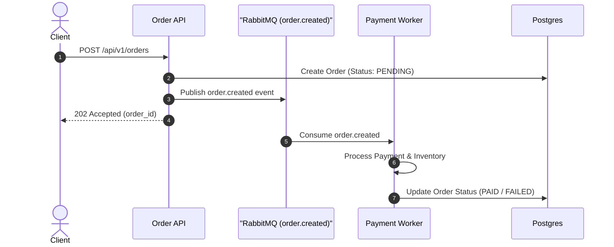

# Pull Requests

Craft reviewer-friendly Pull Request (PR) and Merge Request (MR) titles and descriptions highlighting high-level intent, architecture, and key changes.

## Workflow

1. **Inspect diff & context**: Run `git log <base>..HEAD` and `git diff <base>...HEAD`. Inspect repository templates in `.github/` or `.gitlab/`, linked issues, and specs.
2. **Review existing PR text** (if rewriting): Read current title/body (`gh pr view --json title,body`). Compare with diff and report missing or inaccurate claims grouped by severity before proposing revisions.
3. **Select format**:
   - Small/low-risk PR: Use a single concise paragraph covering outcome, motivation, and verification.
   - Large/complex PR: Use the full structured template.
4. **Draft title & body**: Write `<type>(<scope>): <outcome>` title (≤72 chars). Populate intent, architecture, key changes, and verification.
5. **Add visuals**: Include Mermaid diagrams for structural/state/flow changes, or before/after media for UI edits.

*Completion Criterion*: PR title and description strictly reflect work in the diff, high-level intent is clear without duplicating code diffs, verification commands are documented, and template sections are accurately populated.

## Sizing & Focus Rules

- **Intent-first**: Explain goals, impact, and design decisions. Omit line-by-line diff narration already visible in the code viewer.
- **Single cohesive goal**: Keep PRs focused on a single logical change. Split unrelated changes into separate PRs; use draft PRs for work-in-progress.
- **Reviewer guidance**: For large PRs, suggest a file review sequence (e.g., schema -> core handler -> tests) and specify requested feedback (design, perf, security).

## Title Syntax

Use Conventional Commits: `<type>(<scope>): <outcome>`.

- **Types**: `feat` `fix` `refactor` `perf` `docs` `test` `chore` `build` `ci` `style` `revert`.
- **Format**: Imperative mood, English, ≤72 characters, no trailing period.
- **Focus**: State outcome rather than low-level code edits (`feat(auth): add multi-factor authentication` instead of `fix: update logic in user_service.go`).

## Description Template

Include only relevant sections (omit empty sections):

```markdown
## Summary
A 1–3 sentence high-level overview of what this PR accomplishes.

## Motivation & Context
Why is this change necessary? Link relevant issues (`Closes #123`, `Refs #456`) and business impact.

## Architecture & Diagrams
For structural changes, include a Mermaid diagram visualizing component interactions or data flows.

## Key Changes
Logical high-level changes (subsystem updates, API contract changes). Omit line-by-line file details.

## Reviewer Guidance
(Optional) Suggested file review sequence or specific areas requiring inspection.

## Verification & Testing
How changes were verified (unit test commands, manual verification steps executed).

## Risks & Rollout
Known risks, monitoring signals, rollback steps, or security impact.

## Breaking Changes & Migration
Required configuration updates, database migrations, or breaking API changes.
```

## Mermaid Diagrams

Use Mermaid diagrams for multi-service flows, complex refactors, or state machines:

- **Sequence (`sequenceDiagram`)**: Request/response flows or async messaging.
- **Flowchart (`flowchart TD`)**: Decision routing or data pipelines.
- **State (`stateDiagram-v2`)**: Lifecycle or finite state machine transitions.
- **Entity (`erDiagram` / `classDiagram`)**: Schema or data model changes.

*Rule*: Focus diagrams strictly on changed paths; verify rendering in markdown preview.

## Honesty & Hygiene

- **Evidence-based**: Document only work and verification actually completed; state uncertainty or omit unsupported claims.
- **No fluff or AI trailers**: Omit filler text and AI-attribution footers.
- **UI Media**: Embed before/after screenshots or recordings for visual changes.

## Examples

### Small Bug Fix PR

```markdown
# fix(auth): prevent session leak on logout error

Fixes an edge case where session tokens were not invalidated when the upstream
identity provider returned an error during logout. Local tokens are now removed
before the upstream call, and the failure path is logged as a warning. Added
`TestLogout_UpstreamError_ClearsLocalSession` and manually tested logout during
an identity-provider network failure.

Closes #204
```

### Feature PR

```markdown
# feat(search): implement fuzzy matching for product queries

## Summary
Implements fuzzy text search for product queries using n-gram indexing, improving search result recall for misspelled inputs.

## Motivation & Context
Users frequently misspell search queries (e.g., "iphne" instead of "iphone"), leading to zero search results. This change introduces an n-gram index fallback when exact matches return no results.

Fixes #512

## Key Changes
- **Indexer**: Added `ngram_indexer.go` to construct trigrams for product titles during catalog indexing.
- **Search Engine**: Updated query processor to fall back to trigram similarity scoring when exact match count is below threshold.
- **Configuration**: Added `ENABLE_FUZZY_SEARCH` environment variable (default: `true`).

## Verification & Testing
- Benchmark tests run: `go test -bench=BenchmarkFuzzySearch ./search` showed <5ms P99 latency impact.
- Ran integration tests covering exact match, fuzzy match, and zero-match scenarios.
```

### Complex Architectural Refactor PR (with Mermaid)

````markdown
# refactor(order): migrate synchronous checkout to event-driven queue

## Summary
Refactors order processing from synchronous HTTP handler execution to an asynchronous, event-driven architecture using RabbitMQ, preventing HTTP timeouts under high load.

## Motivation & Context
During peak traffic sales, synchronous payment verification and inventory reservation calls caused database connection pool exhaustion and HTTP 504 gateway timeouts.

Closes #890

## Architecture



## Key Changes
- **API**: Modified `POST /api/v1/orders` handler to return `202 Accepted` immediately after persisting pending order state and publishing event.
- **Worker**: Created `cmd/order-worker` daemon to asynchronously consume `order.created` queue events.
- **Resilience**: Added dead-letter exchange (DLX) for failed payment retries (max 3 attempts).

## Verification & Testing
- Simulated 5,000 concurrent checkout requests via Locust; zero 504 timeouts observed and P95 latency dropped from 2.4s to 45ms.
- Integration test suite: `go test -tags=integration ./pkg/worker/...`.

## Breaking Changes & Migration
- `POST /api/v1/orders` now returns HTTP `202` instead of `200`. Clients must poll `GET /api/v1/orders/{id}` or listen to WebSocket notifications for completion status.
````
