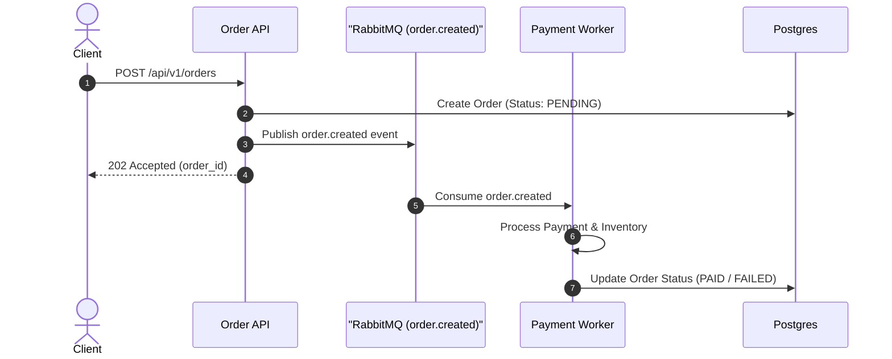

# PR Description Examples

## Small Bug Fix PR

```markdown
# fix(auth): prevent session leak on logout error

Fixes an edge case where session tokens were not invalidated when the upstream
identity provider returned an error during logout. Local tokens are now removed
before the upstream call, and the failure path is logged as a warning. Added
`TestLogout_UpstreamError_ClearsLocalSession` and manually tested logout during
an identity-provider network failure.

Closes #204
```

## Feature PR

```markdown
# feat(search): implement fuzzy matching for product queries

## Summary
Implements fuzzy text search for product queries using n-gram indexing, improving search result recall for misspelled inputs.

## Motivation & Context
Users frequently misspell search queries (e.g., "iphne" instead of "iphone"), leading to zero search results. This change introduces an n-gram index fallback when exact matches return no results.

Fixes #512

## Key Changes
- **Indexer**: Added `ngram_indexer.go` to construct trigrams for product titles during catalog indexing.
- **Search Engine**: Updated query processor to fall back to trigram similarity scoring when exact match count is below threshold.
- **Configuration**: Added `ENABLE_FUZZY_SEARCH` environment variable (default: `true`).

## Verification & Testing
- Benchmark tests run: `go test -bench=BenchmarkFuzzySearch ./search` showed <5ms P99 latency impact.
- Ran integration tests covering exact match, fuzzy match, and zero-match scenarios.
```

## Complex Architectural Refactor PR (with Mermaid)

````markdown
# refactor(order): migrate synchronous checkout to event-driven queue

## Summary
Refactors order processing from synchronous HTTP handler execution to an asynchronous, event-driven architecture using RabbitMQ, preventing HTTP timeouts under high load.

## Motivation & Context
During peak traffic sales, synchronous payment verification and inventory reservation calls caused database connection pool exhaustion and HTTP 504 gateway timeouts.

Closes #890

## Architecture



## Key Changes
- **API**: Modified `POST /api/v1/orders` handler to return `202 Accepted` immediately after persisting pending order state and publishing event.
- **Worker**: Created `cmd/order-worker` daemon to asynchronously consume `order.created` queue events.
- **Resilience**: Added dead-letter exchange (DLX) for failed payment retries (max 3 attempts).

## Verification & Testing
- Simulated 5,000 concurrent checkout requests via Locust; zero 504 timeouts observed and P95 latency dropped from 2.4s to 45ms.
- Integration test suite: `go test -tags=integration ./pkg/worker/...`.

## Breaking Changes & Migration
- `POST /api/v1/orders` now returns HTTP `202` instead of `200`. Clients must poll `GET /api/v1/orders/{id}` or listen to WebSocket notifications for completion status.
````
