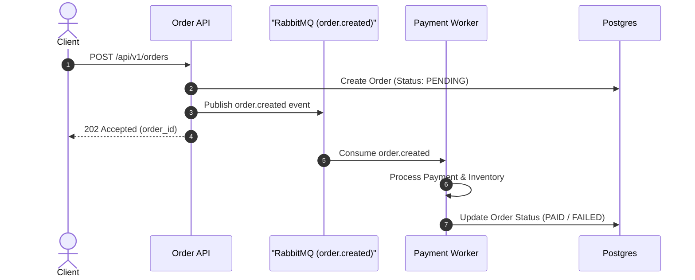

# Pull Requests

Write clear, structured Pull Request (PR) and Merge Request (MR) titles and descriptions focusing on high-level architecture, intent, and goals.

## Core Philosophy

- **Focus on Intent & Architecture**: Explain the goals and impact of the change. Do not repeat low-level code edits or line-by-line diffs that are already visible in the code view.
- **The 5-Minute Rule**: Reviewers should be able to grasp the purpose, context, and approach of your PR within 5 minutes. If not, simplify the description.
- **The Self-Review**: Treat writing the PR description as the first review of your own code. It forces you to validate design decisions and catch obvious errors before notifying others.
- **Keep PRs Small and Focused**: Build PRs around a single, cohesive goal. Do not mix unrelated changes (e.g., refactoring + new feature). Use Draft PRs for work-in-progress.

## Context & Reviewer Guidance

Before drafting or rewriting, run `git log <base>..HEAD` and
`git diff <base>...HEAD` to inspect changes. Check repository PR templates in
`.github/` or `.gitlab/`, plus linked issues, specifications, and design docs.
Describe only work actually present in the diff.

When reviewing existing PR text:
- Read the current PR title and body before proposing changes (use the hosting
  platform's CLI or UI when available, such as `gh pr view --json title,body`).
- Compare the title and body with the diff, repository template, and linked
  requirements. Identify missing, inaccurate, or unsupported claims.
- Report findings first, grouped by severity, then provide suggested wording or
  a revised description.

For complex or large PRs:
- **Suggest a Reading Order**: Provide a logical sequence for reviewing files (e.g., "Start with the schema change, then core handler, then tests").
- **Specify Feedback Type**: Note what feedback you need (e.g., high-level design review, performance verification, security check, or simple sanity check).

## Title

Unless the repository specifies another format, use Conventional Commits: `<type>(<scope>): <outcome>`.
- Types: `feat` `fix` `refactor` `perf` `docs` `test` `chore` `build` `ci` `style` `revert`.
- Use imperative mood, English, ≤72 characters, no trailing period.
- Focus on the outcome, not raw code edits (e.g., `feat(auth): add multi-factor authentication` instead of `fix: update logic in user_service.go`).

## Description Template

Use these sections in the PR body (omit empty or irrelevant sections):

For a small, low-risk PR, a single concise paragraph is enough. Cover the
change, its motivation or user impact, and verification without forcing the
full section template or a diagram.

```markdown
## Summary
A 1–3 sentence high-level overview of what this PR accomplishes.

## Motivation & Context
Why is this change necessary? Link relevant issues (`Closes #123`, `Refs #456`) and explain the business impact or constraints.

## Architecture & Diagrams
For structural changes, include a Mermaid diagram (sequence, flowchart, state, ER) to visualize flows, transitions, or component interactions.

## Key Changes
Logical high-level changes (e.g., subsystem updates, API contract updates). Avoid line-by-line file details.

## Reviewer Guidance
(Optional) Suggested file review sequence or specific areas requiring closer inspection.

## Verification & Testing
Explain how the changes were verified (e.g., unit test commands run, manual verification steps executed).

## Risks & Rollout
Known risks, monitoring signals, rollback steps, or security impact. Omit when irrelevant.

## Breaking Changes & Migration
Required configuration updates, database migrations, or breaking API changes.
```

## Mermaid Diagrams

Use Mermaid diagrams for complex refactors, multi-service integrations, or state machine changes to reduce reviewer cognitive load:
- **Sequence Diagrams (`sequenceDiagram`)**: For multi-service request/response flows or async messaging.
- **Flowcharts (`flowchart TD`)**: For logical routing, decision branching, or data pipelines.
- **State Diagrams (`stateDiagram-v2`)**: For lifecycle states or finite state machines.
- **Class/Entity Diagrams (`classDiagram` / `erDiagram`)**: For database schema or data model shifts.

*Guideline*: Keep diagrams focused strictly on the changed path. Test that syntax renders correctly in markdown preview.

## Sizing, Honesty & Hygiene

- **Scope Integrity**: Describe only work actually present in the PR diff. Do not document uncommitted local changes or planned follow-ups.
- **Evidence Only**: Never invent test results, impact, component ownership, or implementation details. State uncertainty or omit unsupported claims.
- **No Vanity or Fluff**: Avoid filler text and AI-attribution footers.
- **Visuals**: For UI changes, include before/after screenshots or recordings when available.

## Examples

### Small Bug Fix PR

```markdown
# fix(auth): prevent session leak on logout error

Fixes an edge case where session tokens were not invalidated when the upstream
identity provider returned an error during logout. Local tokens are now removed
before the upstream call, and the failure path is logged as a warning. Added
`TestLogout_UpstreamError_ClearsLocalSession` and manually tested logout during
an identity-provider network failure.

Closes #204
```

### Feature PR

```markdown
# feat(search): implement fuzzy matching for product queries

## Summary
Implements fuzzy text search for product queries using n-gram indexing, improving search result recall for misspelled inputs.

## Motivation & Context
Users frequently misspell search queries (e.g., "iphne" instead of "iphone"), leading to zero search results. This change introduces an n-gram index fallback when exact matches return no results.

Fixes #512

## Key Changes
- **Indexer**: Added `ngram_indexer.go` to construct trigrams for product titles during catalog indexing.
- **Search Engine**: Updated query processor to fall back to trigram similarity scoring when exact match count is below threshold.
- **Configuration**: Added `ENABLE_FUZZY_SEARCH` environment variable (default: `true`).

## Verification & Testing
- Benchmark tests run: `go test -bench=BenchmarkFuzzySearch ./search` showed <5ms P99 latency impact.
- Ran integration tests covering exact match, fuzzy match, and zero-match scenarios.
```

### Complex Architectural Refactor PR (with Mermaid)

````markdown
# refactor(order): migrate synchronous checkout to event-driven queue

## Summary
Refactors order processing from synchronous HTTP handler execution to an asynchronous, event-driven architecture using RabbitMQ, preventing HTTP timeouts under high load.

## Motivation & Context
During peak traffic sales, synchronous payment verification and inventory reservation calls caused database connection pool exhaustion and HTTP 504 gateway timeouts.

Closes #890

## Architecture



## Key Changes
- **API**: Modified `POST /api/v1/orders` handler to return `202 Accepted` immediately after persisting pending order state and publishing event.
- **Worker**: Created `cmd/order-worker` daemon to asynchronously consume `order.created` queue events.
- **Resilience**: Added dead-letter exchange (DLX) for failed payment retries (max 3 attempts).

## Verification & Testing
- Simulated 5,000 concurrent checkout requests via Locust; zero 504 timeouts observed and P95 latency dropped from 2.4s to 45ms.
- Integration test suite: `go test -tags=integration ./pkg/worker/...`.

## Breaking Changes & Migration
- `POST /api/v1/orders` now returns HTTP `202` instead of `200`. Clients must poll `GET /api/v1/orders/{id}` or listen to WebSocket notifications for completion status.
````
