# Pull Requests

Write clear, structured Pull Request (PR) and Merge Request (MR) titles and
descriptions for reviewers and future maintainers inspecting repository
history.

A good PR description communicates the motivation, high-level approach,
testing strategy, and potential risks without repeating line-by-line diffs
that reviewers can already see in the code view.

Before drafting or updating a PR description, inspect the complete set of
changes between the base branch and the head branch.

## Context Gathering

Inspect the changes being proposed before drafting the description:

- Run `git log <base-branch>..HEAD` (or `git log origin/main..HEAD`) to
  review all commits included in the PR.
- Run `git diff <base-branch>...HEAD` to inspect the unified changes.
- Check linked issues, task specifications, or design documents for
  motivation, background context, and requirements.

Describe only the material changes present in the diff. Never document
uncommitted local changes or planned follow-up work as part of the current
PR.

Follow repository-specific PR template guidelines when present in `.github/`
or `.gitlab/`. Preserve the rules below wherever they still apply.

## Title

Unless the repository specifies another format, align the PR title with
Conventional Commits: `<type>(<scope>): <outcome>`.

- Types: `feat` `fix` `refactor` `perf` `docs` `test` `chore` `build` `ci` `style` `revert`.
- Imperative mood, English, ≤72 characters preferred, no trailing period.
- Focus on the outcome or intent, not raw code edits:
  - `feat(auth): add multi-factor authentication support` (Good)
  - `fix: update logic in user_service.go` (Poor)
- Keep titles readable in pull request lists, release notes, and commit graphs.

## Description Body

Structure the description to help reviewers understand **why** the change was
made, **what** changed at a high level, and **how** it was verified.

Adjust the level of detail based on complexity and risk:
- Small, low-risk changes (e.g. minor bug fix or typo) need only a concise
  overview and verification note.
- Large features, architectural refactors, or security fixes require full
  structured sections and visual diagrams (e.g. Mermaid).

### Recommended Sections

```markdown
## Summary

A concise (1–3 sentence) overview of what this PR does and the problem it solves.

## Motivation & Context

Why is this change necessary? Link relevant issues or tasks (`Closes #123`, `Refs #456`).
Include relevant background, design constraints, or trade-offs considered.

## Architecture & Diagrams

For complex or structural changes, include a Mermaid diagram (sequenceDiagram,
flowchart, or stateDiagram) to visualize data flow, component interactions,
or state transitions.

## Key Changes

Group major changes into logical bullet points:
- **Component / Subsystem**: High-level description of changes or new capabilities.
- **API / Schema**: Any added, modified, or deprecated interfaces.

## Verification & Testing

Explain how the changes were tested:
- Automated tests run (e.g., `npm test`, `go test ./...`).
- Manual testing steps executed.
- Edge cases verified.

## Breaking Changes & Migration

Highlight any breaking changes, required configuration updates, or database migration steps.
Omit this section if there are no breaking changes.
```

## Diagrams & Visualizations (Mermaid)

For complex PRs, structural refactors, multi-service integrations, or state machine changes, **always use Mermaid diagrams** to help reviewers visualize the architecture and execution flow.

- **Sequence Diagrams (`sequenceDiagram`)**: Best for multi-service interactions, async event handling, or client-server request/response flows.
- **Flowcharts (`flowchart TD` / `flowchart LR`)**: Best for decision branching, data pipeline steps, or algorithm logic.
- **State Diagrams (`stateDiagram-v2`)**: Best for entity lifecycles, job statuses, or finite state machines.
- **Class / Entity Diagrams (`classDiagram` / `erDiagram`)**: Best for data model shifts or database schema redesigns.

### Mermaid Syntax Guidelines
- Keep diagrams concise and focused directly on the changed or affected flow; do not try to diagram the entire system.
- Quote node labels containing special characters or parentheses.
- Test that syntax renders cleanly in GitHub/GitLab markdown views.

## Sizing & Detail Guidelines

- **Conciseness**: Write for busy reviewers. Prefer structured bullet points and visual diagrams over long dense paragraphs.
- **Diff vs Description**: Do not list filenames line-by-line or summarize what git diff already makes obvious. Focus on intent, design rationale, and non-obvious consequences.
- **Screenshots & Media**: For visual UI changes, include before/after screenshots or short screen recordings when possible.

## Honesty & Hygiene

- **Scope Integrity**: Describe only work actually included in the PR diff.
- **No Vanity or Fluff**: Avoid filler phrases like "This PR introduces an amazing improvement" or self-congratulatory remarks.
- **No Harness Footers**: Omit AI attribution tags (e.g., `Generated by...`, `Co-Authored-By: AI...`) unless required by repository policies.

## Examples

### Small Bug Fix PR

```markdown
# fix(auth): prevent session leak on logout error

## Summary
Fixes an edge case where session tokens were not invalidated if the upstream identity provider returned an error during logout.

## Key Changes
- Always remove local session tokens from memory before calling upstream logout.
- Log identity provider logout errors as warnings instead of aborting session cleanup.

## Verification
- Added unit test `TestLogout_UpstreamError_ClearsLocalSession`.
- Manually tested logout while forcing network failure to identity provider.

Closes #204
```

### Feature PR

```markdown
# feat(search): implement fuzzy matching for product queries

## Summary
Implements fuzzy text search for product queries using n-gram indexing, improving search result recall for misspelled inputs.

## Motivation & Context
Users frequently misspell search queries (e.g., "iphne" instead of "iphone"), leading to zero search results. This change introduces an n-gram index fallback when exact matches return no results.

Fixes #512

## Key Changes
- **Indexer**: Added `ngram_indexer.go` to construct trigrams for product titles during catalog indexing.
- **Search Engine**: Updated query processor to fall back to trigram similarity scoring when exact match count is below threshold.
- **Configuration**: Added `ENABLE_FUZZY_SEARCH` environment variable (default: `true`).

## Verification & Testing
- Benchmark tests run: `go test -bench=BenchmarkFuzzySearch ./search` showed <5ms P99 latency impact.
- Ran integration tests covering exact match, fuzzy match, and zero-match scenarios.

## Breaking Changes
None. The fallback triggers only when exact search yields zero results.
```

### Complex Architectural Refactor PR (with Mermaid)

````markdown
# refactor(order): migrate synchronous checkout to event-driven queue

## Summary
Refactors order processing from synchronous HTTP handler execution to an asynchronous, event-driven architecture using RabbitMQ, preventing HTTP timeouts under high load.

## Motivation & Context
During peak traffic sales, synchronous payment verification and inventory reservation calls caused database connection pool exhaustion and HTTP 504 gateway timeouts.

Closes #890

## Architecture

```mermaid
sequenceDiagram
    autonumber
    actor Client
    participant API as Order API
    participant Queue as RabbitMQ (order.created)
    participant Worker as Payment Worker
    participant DB as Postgres

    Client->>API: POST /api/v1/orders
    API->>DB: Create Order (Status: PENDING)
    API->>Queue: Publish order.created event
    API-->>Client: 202 Accepted (order_id)
    
    Queue->>Worker: Consume order.created
    Worker->>Worker: Process Payment & Inventory
    Worker->>DB: Update Order Status (PAID / FAILED)
```



## Key Changes
- **API**: Modified `POST /api/v1/orders` handler to return `202 Accepted` immediately after persisting pending order state and publishing event.
- **Worker**: Created `cmd/order-worker` daemon to asynchronously consume `order.created` queue events.
- **Resilience**: Added dead-letter exchange (DLX) for failed payment retries (max 3 attempts).

## Verification & Testing
- Simulated 5,000 concurrent checkout requests via Locust; zero 504 timeouts observed and P95 latency dropped from 2.4s to 45ms.
- Integration test suite: `go test -tags=integration ./pkg/worker/...`.

## Breaking Changes & Migration
- `POST /api/v1/orders` now returns HTTP `202` instead of `200`. Clients must poll `GET /api/v1/orders/{id}` or listen to WebSocket notifications for completion status.
````
